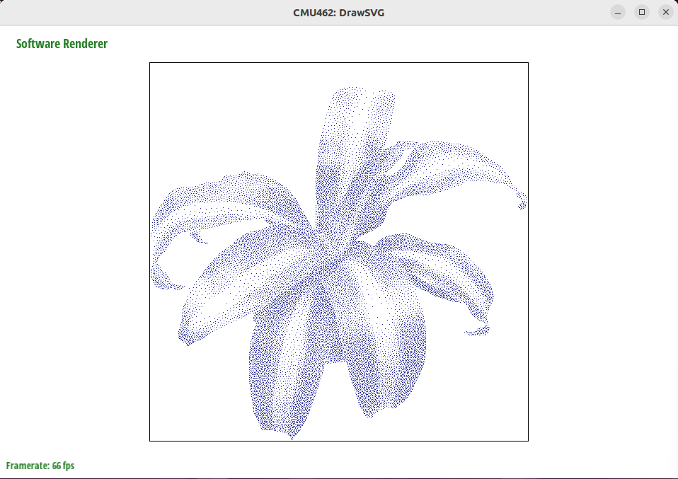
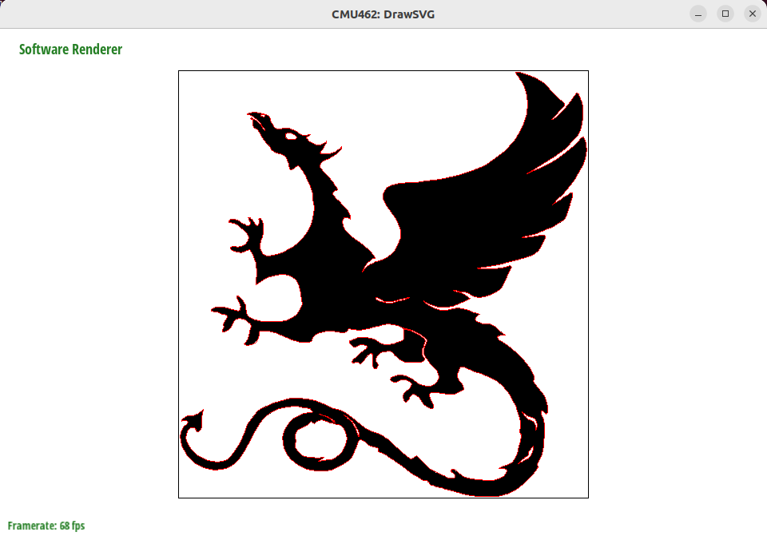
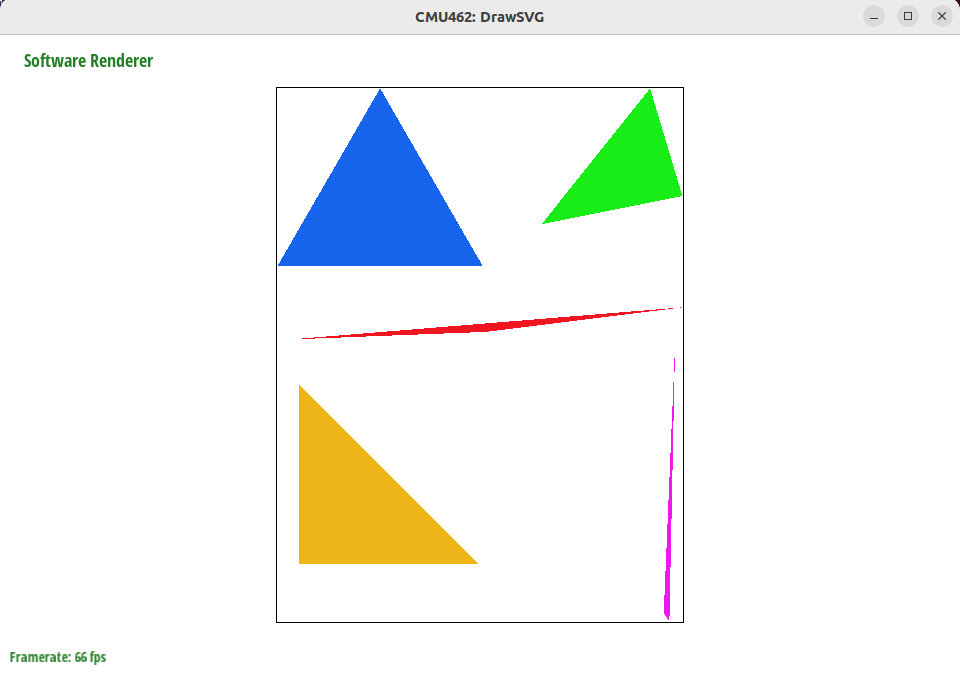
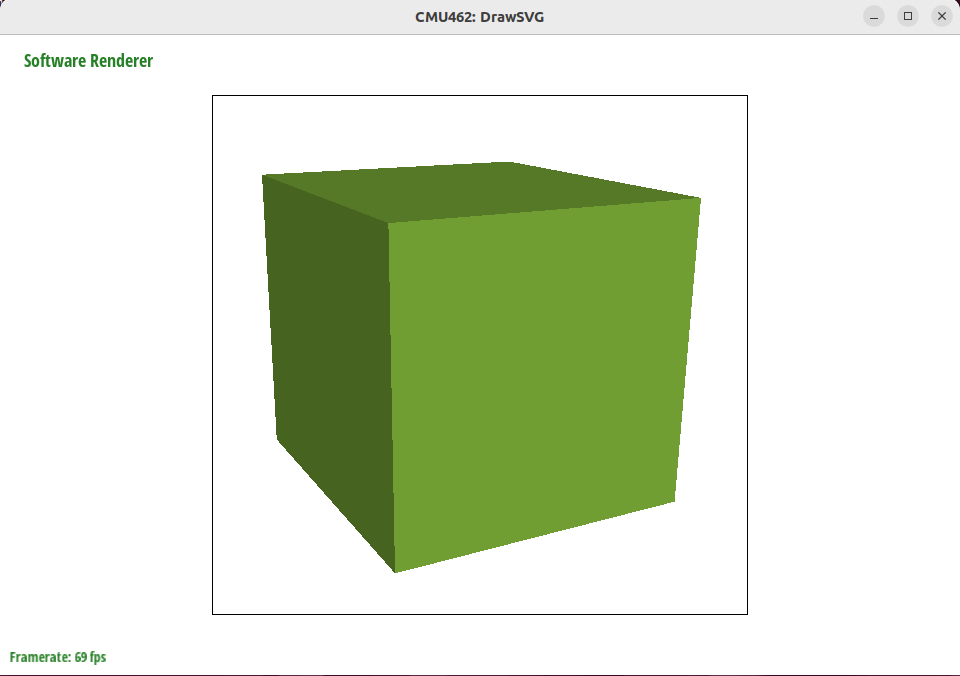
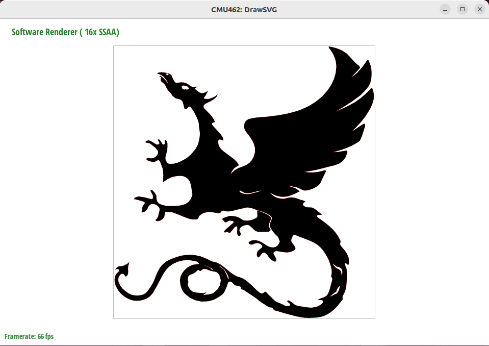
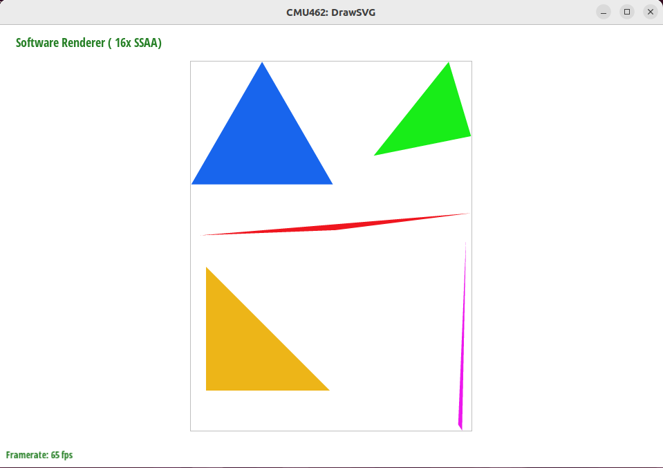
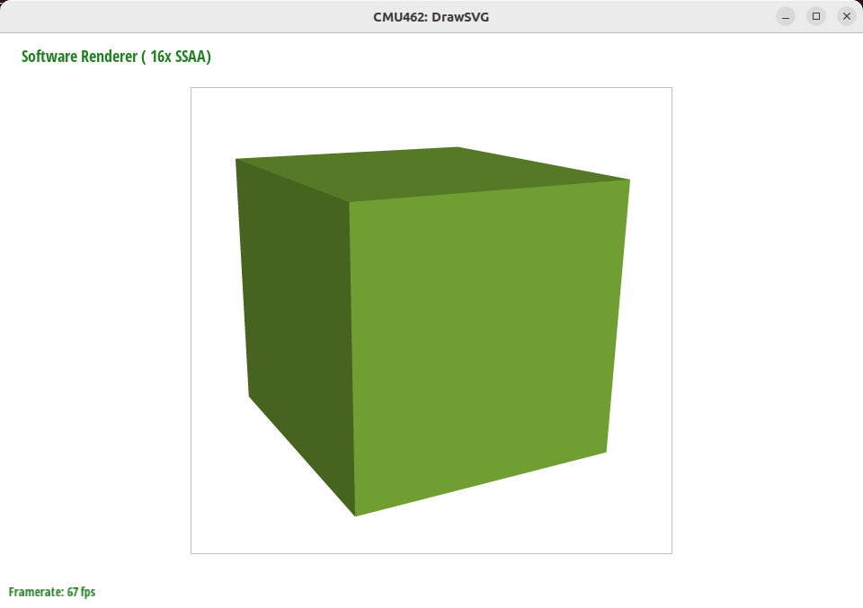
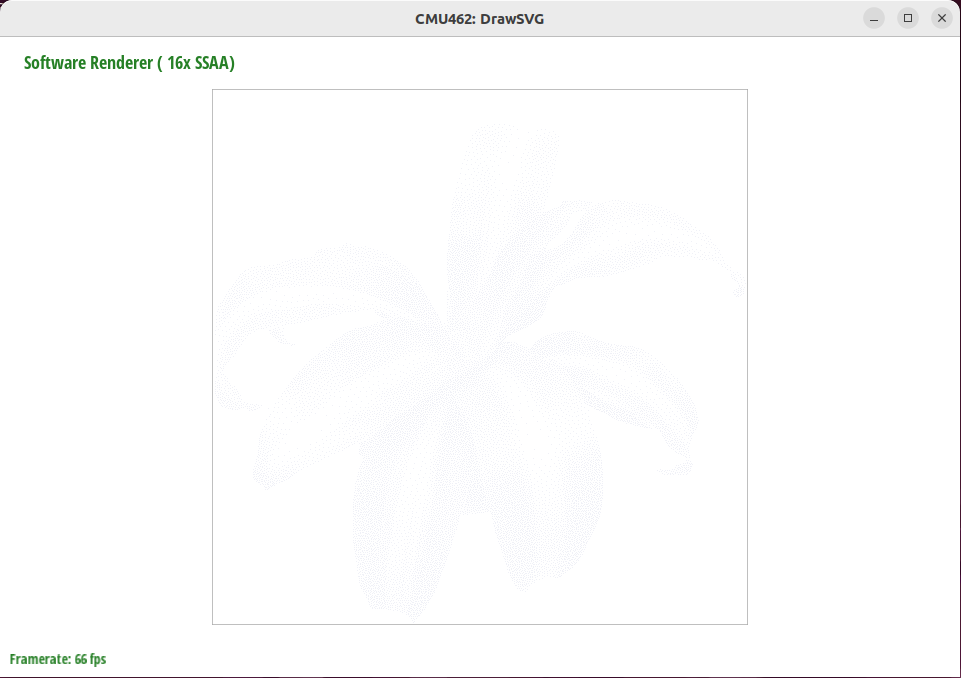
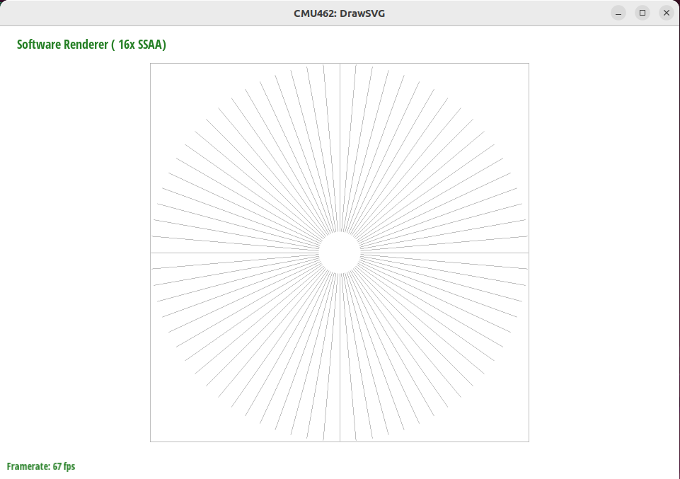

# 作业-1 DrawSVG

## Task 2 : Drawing Lines

### 操作

使用Bresenham算法实现`software_renderer.cpp`中的`rasterize_line()`，通过使用整数运算和递增的方式来绘制直线，避免了浮点数运算和取整带来的性能损耗。

### 实验结果

## Task 3 : Drawing Triangles

### 操作

使用向量计算法实现`software_renderer.cpp`中的`rasterize_triangle()`。在三角形的边界框内，遍历计算每个像素点的属性值。

### 实验结果

## Task 4 : Supersampling

### 操作

使用更大的缓冲区sample_buffer来保存每个超采样结果。并使用unit-area box filter算法来进行重新采样。

### 实验结果

#### test3对比

#### test4对比

#### test5对比

### 问题

#### test1

#### test2

启用超采样渲染后，test1和test2的光栅化会出现问题。暂时没有解决问题。
