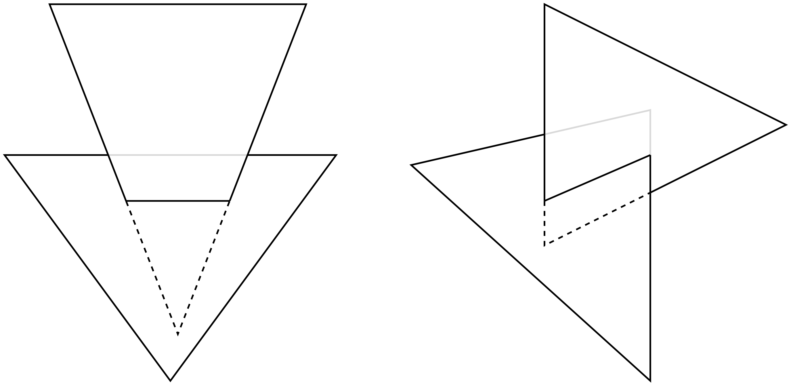
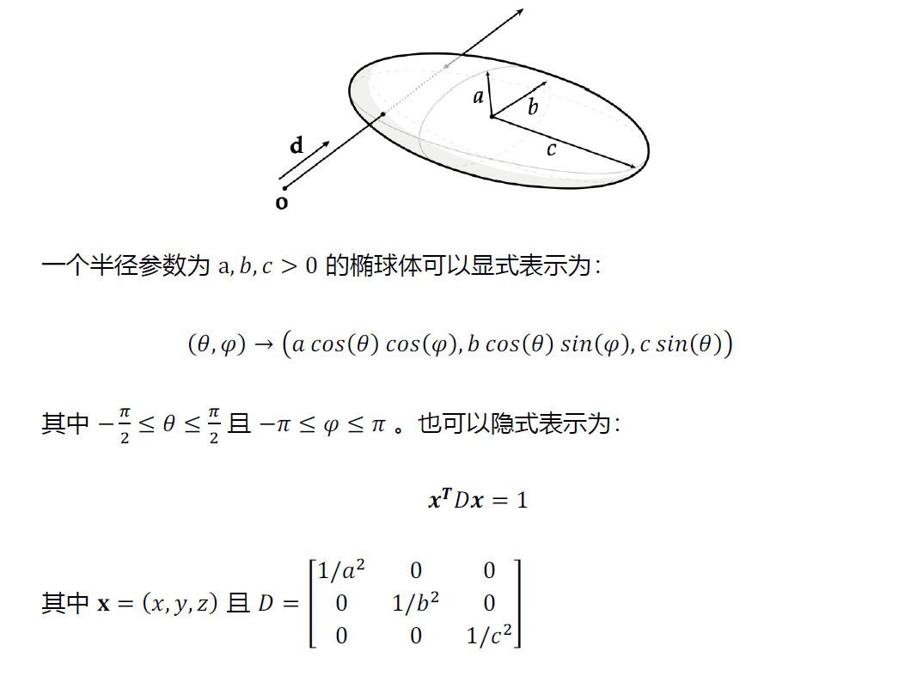
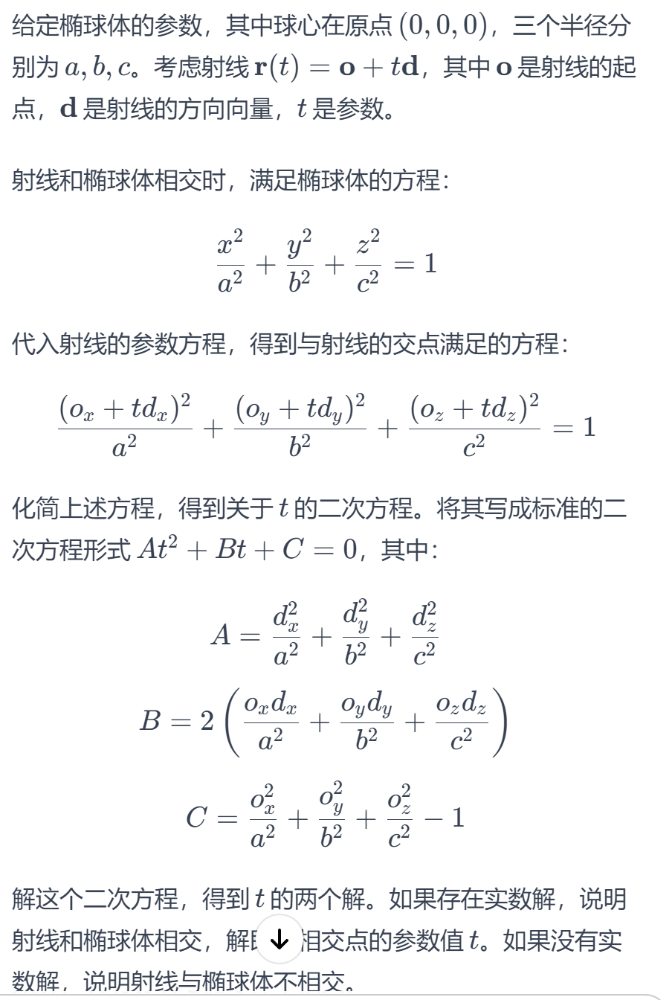

1

（1）

> 简述纹理映射的概念及其作用。

texture_mapping

概念：把一张2D图片包裹3D物体，以模拟表面的细节和外观。

作用：

- 定义表面反射率的变化
- 描述表面材料特性
- 法线和置换贴图
- 计算的照明和阴影
- 添加细节

（2）

> 简述如何判断一个多边形网格是否为流形多边形网格 (manifold polygon
> mesh)。

meshes

两个简单的条件：

1. 每条“内部”边只包含在两个多边形中
2. 每个“内部”点与顶点的连线构成一圈循环的多边形

（3）

> 假设你有一台RGB 显示器，其中红色、绿色和蓝色的电线被调换，电脑输出的
> 红色、绿色和蓝色分别接到了显示器的绿色、红色和蓝色输入端。当在屏幕上
> 输出以下颜色时，实际上会分别显示什么颜色？
> a) 青色 (Cyan)
> b) 洋红色 (Magenta)
> c) 黄色 (Yellow)
> d) 黑色 (Black)
> e) 白色 (White)

青色(0, 255, 255)，由于红绿色输入调换，实际上为(255,0,255)，显示为红色

洋红色(255,0,255)，由于红绿色输入调换，实际上为(0, 255, 255)，显示为红色

黄色(255, 255, 0)，输入不变，显示为黄色

黑色(0, 0 ,0)，输入不变，显示为黑色

白色(255, 255, 255)，输入不变，显示为白色

2 三角形相交 ray_geometry_interact

> 简述判断两个三角形是否相交（及具体相交情况）的步骤。

已知光线与三角形相交的算法

两个三角形相交：

- 要么一个三角形的两条边与另一个三角形相交（上图左侧）
- 或者两个三角形的一条边与另一个三角形相交（上图右侧）

检查第一个三角形的每一条边是否与第二个三角形相交，若有且仅有一条这样的边，说明两个三角形相交情况如上图右侧。若有两条边，说明相交情况如上图左侧。

3 椭球体渲染

（1）

>当使用光线追踪或光栅化的方法来可视化椭球体时，你会分别使用哪种方法表示椭球体？为什么？

光线追踪：隐式表示。这是因为光线追踪中的相交测试通常涉及解方程，而使用隐式表示可以更容易地进行相交测试。通过将光线的参数代入椭球的隐式方程，我们可以判断是否有相交点。

光栅化：显式表示。这是因为在屏幕上的像素级别，使用显式表示更容易计算并进行图形渲染。显式表示可以直接转换为屏幕空间，而不需要解方程。

（2）

> 对于射线 𝐫(𝑡) = 𝐨 + 𝑡𝐝，其中 𝑡 为时间。当时间 𝑡 为何值时该射线会与椭球体相交？给出相交时 𝑡 关于 𝐨, 𝐝 和 𝐷 的显式表达式，并根据公式说明不同条件下的相交情况。（提示：使用二次方程的求解公式）

